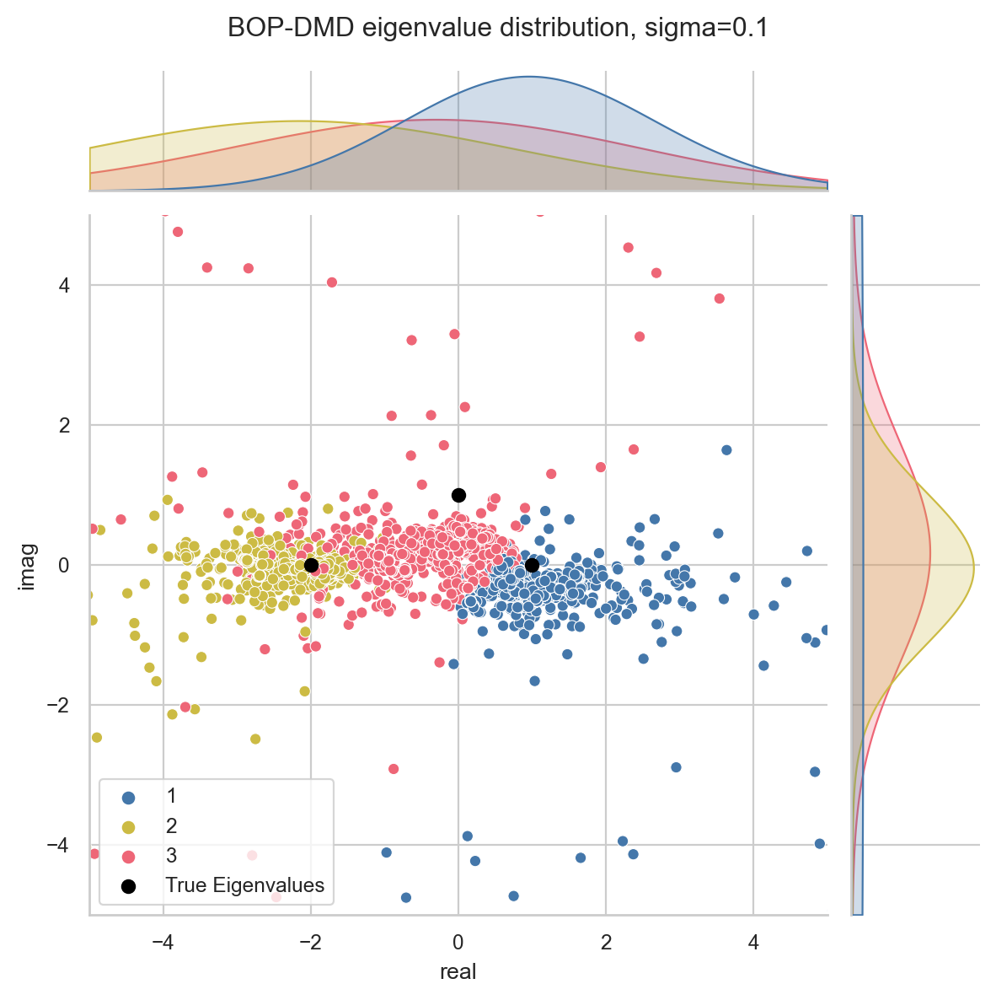

# pyoptDMD

A Python implementation of the optimized Dynamic Mode Decomposition (optDMD) [original
MATLAB version by Travis Askham](https://github.com/duqbo/optdmd) and the Bagging,
Optimized DMD (BOP-DMD) [MATLAB version by Sashidhar](https://github.com/dsashid/BOP-DMD).

Both the optDMD and BOP-DMD were previously only matlab implementations. The focus of this
repository is the implementation and testing of the python translations.

1) [optDMD](https://github.com/klapo/pyoptDMD/blob/main/examples/ex_optDMD.ipynb) 
   provides an optimized framework for solving the DMD regressions that may come from 
   unevenly spaced time snapshots. Additionally, the optDMD is less biased than 
   standard DMD algorithms.
2) [BOP-DMD](https://github.com/klapo/pyoptDMD/blob/main/examples/ex-BOP-DMD.ipynb) 
   takes advantage of this property and solves the DMD using statistical
   bagging (i.e., randomly selected ensembles) for constructing the DMD.

The advantage of the combined BOP-DMD is: (a) the additional ability to provide
uncertainty estimates in the DMD solutions, especially the uncertainty in the spatial
modes, (b) the ability to better represent the time dynamics for more complex systems such
as those commonly found in geophysics, and (c) robustly solving the DMD for noisy data.

# Current status:

The code successfully solves for dmd modes in both the Bagging, Optimized DMD and
optDMD frameworks. The python code exactly replicates the matlab implementation for 
the zero noise case (see tests). At smaller levels of noise (sigma< 0.05) the two 
implementations agree.

For larger levels of noise [a bug became apparent](#solution-bug-for-very-noisy-data) 
in both the MATLAB and python versions. A simple workaround is provided for the BOP-DMD.

The optDMD and the BOP-DMD are both demonstrated using the ["Simple Example" from 
Sashidhar and Kutz (2022)](https://github.com/dsashid/BOP-DMD/blob/main/BOP_DMD_main.m). Here 
Three spatial modes are fit and each mode has time dynamics which are exponential in time.

## optDMD

See the `ex_optDMD.ipynb` notebook for example details. A comparable set of plots can 
be generated using the provided .mlx file.

## BOP-DMD implementation using pyoptDMD

BOP-DMD is demonstrated in both the reference MATLAB code and using pyoptDMD. The
example follows the same simple example from Sashidhar and Kutz (2022) as in the
optDMD example. A comparable set of plots can be generated using the provided .mlx files.

The python version uses the quick-and-dirty workaround for solving the BOP-DMD with 
very noisy data.

### BOP-DMD with sigma=0.1 from python code

See the `ex-BOP-DMD.ipynb` notebook for implementation details.

### BOP-DMD with sigma=0.1 from reference matlab code

And for reference here is the MATLAB code for the BOP-DMD with $\sigma$=0.1.

### Solution bug for very noisy data

See the `BOP-DMD.debug-noisy-data.ipynb` for exact details.

The optDMD algorithm appears to run into problems when using only the predicted change
in lambda, as the largest errors in eigenvalues occur when the code exits
after reaching the maximum number of iterations using only this strategy. However, when
the algorithm exits due to a stall or after entering the
gradient descent search, these errors are usually much smaller (e.g., by an order of
magnitude). Possible explanations are: getting stuck on a local minimum or ensemble
members with poor sampling characteristics.

Generally, it appears that the reference matlab code enters this state on a more
frequent basis than the python code. Consequently, the reference
matlab implementation has some problems with very large values of noise, although it
is difficult to assess exactly which levels of noise were tested in the manuscript.

These findings are curious, but suggest improvements to the BOP-DMD algorithm. Namely,
that ensemble members exiting with these statuses could be removed.

# Potential To Dos:

- Implement the optDMD solution using the projected POD modes.
- Build an interface for BOP-DMD.
- Resolve [discrepancies between the MATLAB and python versions](https://github.com/kunert/py-optDMD/issues/1)

# Citations:

Askham, T., & Kutz, J. N. (2018). Variable projection methods for an optimized
dynamic mode decomposition. SIAM Journal on Applied Dynamical Systems, 17(1), 380–416.
https://doi.org/10.1137/M1124176

Sashidhar, D., & Kutz, J. N.
(2022). Bagging, optimized dynamic mode decomposition for robust, stable forecasting
with spatial and temporal uncertainty quantification. Philosophical Transactions of
the Royal Society A: Mathematical, Physical and Engineering Sciences, 380(2229).
https://doi.org/10.1098/rsta.2021.0199
