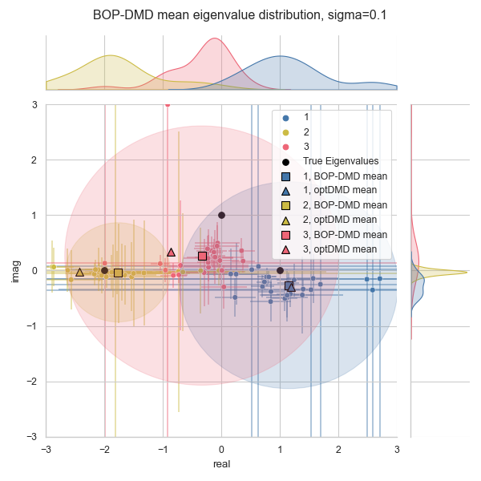

# pyoptDMD

Variable Projection Methods for an Optimized Dynamic Mode Decomposition (optDMD).

A Python implementation of code for computing optimized DMD as developed by Askham and 
Kutz (2018). This code is converted from the original [MATLAB version by Travis Askham]
(https://github.com/duqbo/optdmd).

See the [example jupyter notebook](https://github.com/klapo/pyoptDMD/blob/examples/examples/simple_example.ipynb) for a quick demonstration. Comparable figures from the reference matlab code are available in examples.

### Current status:

The code successfully solves for dmd modes in both the Bagging, Optimized DMD and 
optDMD frameworks.

Generally, it appears that the reference matlab code has some problems with very large values of noise (larger than those explored in the manuscript). These issues do not appear in the python implementation, which is curious. At smaller levels of noise the two implementations more closely agree.

#### BOP-DMD with sigma=0.1 from reference matlab code

#### BOP-DMD with sigma=0.1 from python code

# Citations:

Askham, T., & Kutz, J. N. (2018). Variable projection methods for an optimized 
dynamic mode decomposition. SIAM Journal on Applied Dynamical Systems, 17(1), 380–416. 
https://doi.org/10.1137/M1124176